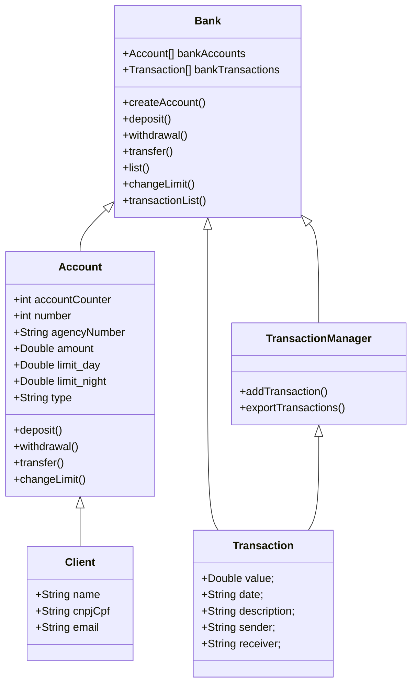

[mermaid-history-2024-03-19-151429.json](https://github.com/nathaliavi/BankApp/files/14655556/mermaid-history-2024-03-19-151429.json)# BankApp

A aplicação funciona a partir da interação do usuário com a terminal. Exibe-se um menu com as operações que são possíveis de serem realizadas pelo banco. 

O usuário deve, então, digitar um dos números do menu para prosseguir com a operação. 

Algumas considerações relevantes: 

- Há dois tipos de contas bancárias: S(salário) e D(depósito). A diferenaça entre elas é que somente a depósito permite realizar transferências entre contas.
- Para o horário noturno, considera-se o período entre 22h e 6h. Nesse intervalo, utiliza-se o parâmetro limit_night. Das 6h às 22h, utiliza-se limit_day.
- É realizada validação da entrada digitada pelo usuário para os campos de nome (apenas letras), cpfCnpj (apenas números), email e tipo de conta (apenas D ou S).
- A agência deve ser incluída manualmente pelo usuário pois, teoricamente, estaria vinculada à cidade da pessoa. 
- Para verificar se o limite de dinheiro permitido em transações foi atingido, utiliza-se o somatório das transferências bancárias e saques. 
- Sobre o arquivo .csv de exportação com as transações:
  - Ficará salvo na pasta Desktop.
  - Para saques, o receiver id é "external".
  - Para depósitos, o sender id é "external".
  - O formato da data é no tipo "yyyy-MM-dd".

